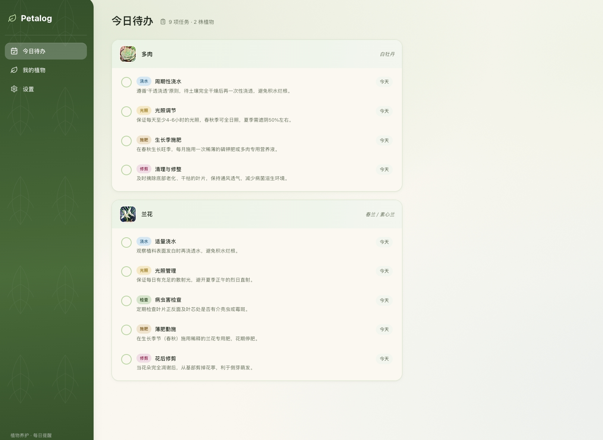
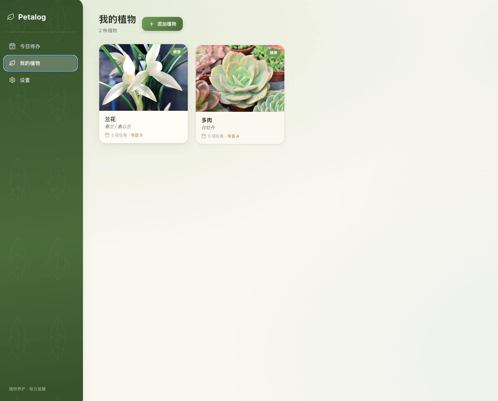
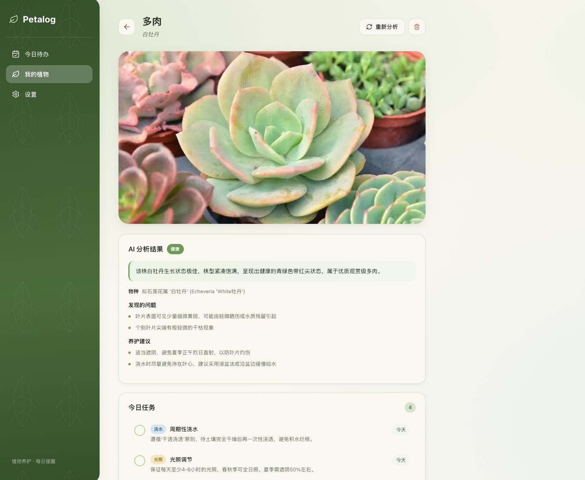

# Petalog · 植物养护提醒

> 上传植物照片，AI 识别物种、评估健康并生成专属养护日程，每日提醒你浇水、施肥、修剪。

一个纯前端的植物养护助手应用，融合亲生物（Biophilic）设计风格，将自然元素带入数字界面，营造平静、疗愈的使用体验。

## 📸 界面预览

**今日待办** — 汇总所有植物今日到期的养护任务，按植物分组展示



**我的植物** — 卡片展示植物照片、物种、健康状态与任务数



**植物详情** — AI 分析结果（物种识别、健康评估、问题与建议）及养护日程



## ✨ 功能特性

- **📷 照片智能分析** — 上传植物照片，调用 GLM 多模态视觉模型，识别物种、评估健康状态、列出问题并给出养护建议
- **📅 自动养护日程** — 根据植物物种与当前状态，自动生成浇水、施肥、修剪、光照、检查等周期性任务
- **🌱 今日待办** — 汇总所有植物今天到期的任务，勾选完成后自动推进下次提醒时间
- **🔔 每日提醒** — 浏览器通知，每天首次打开时提醒今日待办
- **🎨 亲生物设计** — 苔绿/叶绿/土褐/天光蓝色盘，有机曲线、叶脉纹理与纸纤维质感，柔和光影交互
- **🔒 纯前端** — 无后端，所有数据保存在浏览器本地（localStorage），API Key 由用户自行配置

## 🛠 技术栈

- **React 18** + **TypeScript**
- **Vite** 构建工具
- **GLM OpenAI 兼容多模态 API**（默认 `GLM-5V-Turbo`，支持图像输入）
- **localStorage** 数据持久化
- **Browser Notifications API** 提醒
- **lucide-react** 图标 · **date-fns** 日期处理
- 纯手写 CSS（亲生物主题）

## 🚀 快速开始

### 环境要求

- Node.js 18+
- npm 或其他包管理器

### 安装与运行

```bash
# 安装依赖
npm install

# 启动开发服务器
npm run dev

# 构建生产版本
npm run build

# 预览生产构建
npm run preview
```

启动后访问 http://localhost:5173

### 配置 API

1. 打开应用，进入左侧「设置」
2. 填入你的 GLM API Key（在 [智谱开放平台](https://open.bigmodel.cn/) 获取）
3. Base URL 已默认为 `https://open.bigmodel.cn/api/paas/v4`，模型默认为 `GLM-5V-Turbo`（需为支持图像输入的视觉模型）
4. 点击「测试连接」确认配置成功

### 使用流程

1. 进入「我的植物」→ 点击「添加植物」
2. 上传植物照片（可选填名称）→ 点击「上传并分析」
3. AI 识别完成后，自动生成养护建议与日程
4. 在「今日待办」查看并完成每日任务
5. （可选）在设置中开启浏览器通知提醒

## 📁 项目结构

```
Petalog/
├── index.html
├── public/
│   └── leaf.svg                # 叶子图标
├── src/
│   ├── main.tsx                # 入口
│   ├── App.tsx                 # 根组件 + 路由
│   ├── types.ts                # 类型定义
│   ├── constants.ts            # 常量与默认配置
│   ├── api/
│   │   └── client.ts           # GLM API 客户端（多模态 + JSON 解析）
│   ├── lib/
│   │   ├── storage.ts          # localStorage 读写
│   │   ├── image.ts            # 图片压缩转 base64
│   │   ├── schedule.ts         # 日程周期与今日任务计算
│   │   ├── notifications.ts    # 浏览器通知
│   │   └── id.ts               # ID 生成
│   ├── hooks/
│   │   └── useStore.tsx        # 全局状态与 actions
│   ├── components/             # UI 组件
│   │   ├── Layout.tsx
│   │   ├── Sidebar.tsx
│   │   ├── TodayView.tsx       # 今日待办
│   │   ├── PlantListView.tsx   # 植物列表
│   │   ├── PlantCard.tsx
│   │   ├── PlantDetail.tsx     # 植物详情
│   │   ├── AddPlantModal.tsx   # 添加植物
│   │   ├── SettingsView.tsx    # 设置
│   │   ├── TaskItem.tsx
│   │   ├── HealthBadge.tsx
│   │   └── EmptyState.tsx
│   └── styles/
│       ├── index.css           # 主题变量与全局样式
│       └── components.css      # 组件样式
├── vite.config.ts
├── tsconfig.json
└── package.json
```

## ⚠️ 说明

- **数据存储**：纯前端应用，植物信息、API Key、养护日程均保存在浏览器 localStorage，清除浏览器数据会导致丢失，请知悉。
- **API 费用**：调用 GLM API 产生的费用由你自己的 API Key 承担。
- **模型要求**：照片分析需使用支持图像输入的视觉模型（如 `GLM-5V-Turbo`）；若改用纯文本模型则无法识别照片。

## 📄 License

MIT
